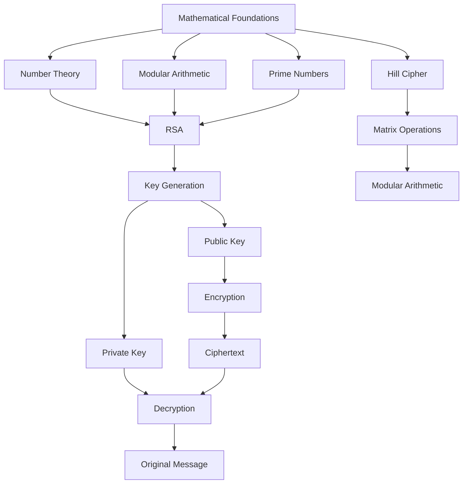
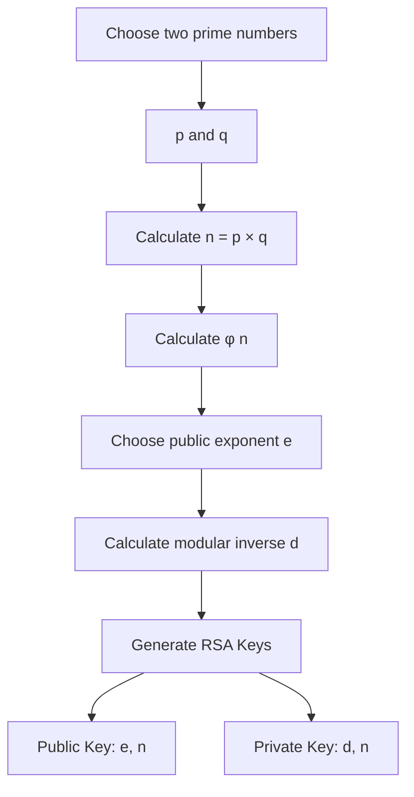
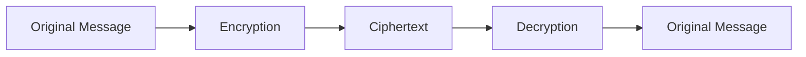
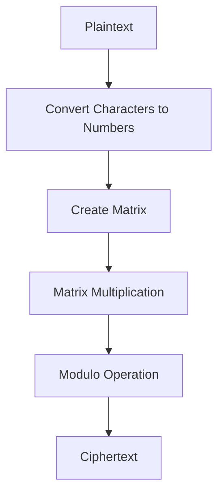
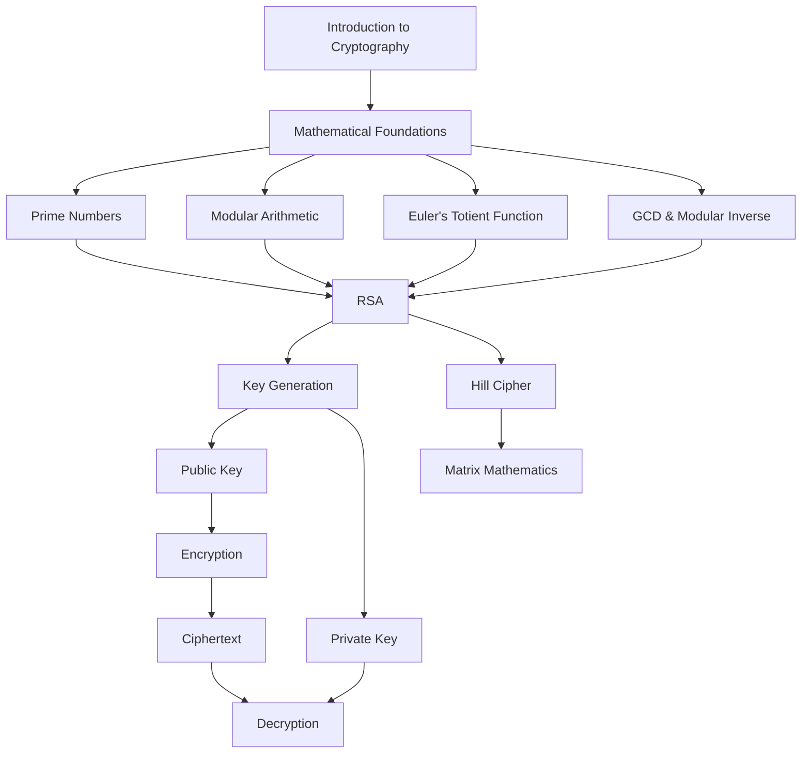
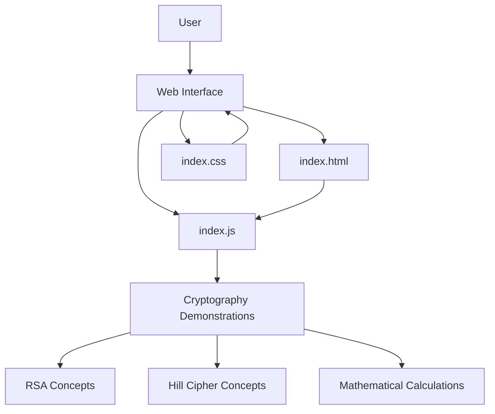
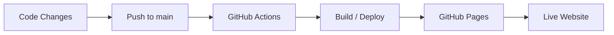

# RSA Cryptography

> **Mathematics Behind Secure Communication**

An educational web-based project that demonstrates how **mathematics and number theory power modern cryptography and secure communication**.

The project explores the mathematical foundations of **RSA encryption**, including prime numbers, modular arithmetic, Euler's Totient Function, public and private keys, key generation, encryption, and decryption. It also introduces the **Hill Cipher** to demonstrate how matrix mathematics can be applied to cryptography.

🏆 **3rd Prize — National Mathematics Day University-Level Model Presentation/Exhibition**

🌐 **Live Demo:** https://the-nidhi-bhat.github.io/cryptography-rsa/

---

## Overview

Cryptography is built on mathematical principles that allow information to be protected from unauthorized access.

However, concepts such as modular arithmetic, prime numbers, Euler's Totient Function, and modular inverses can initially feel abstract.

This project turns those concepts into an **interactive educational web experience**, connecting mathematical theory with practical cryptographic operations.

### The project demonstrates

* Prime numbers
* Number theory
* Modular arithmetic
* Greatest Common Divisor (GCD)
* Euler's Totient Function
* Modular inverse
* Public and private keys
* RSA key generation
* RSA encryption
* RSA decryption
* Hill Cipher fundamentals

---

## Problem Statement

Sensitive information such as messages, passwords, financial information, and personal data needs protection during digital communication.

Cryptography provides mathematical techniques for securing such information, but learning cryptography only through formulas can make the underlying ideas difficult to visualize.

The goal of this project is to make the **mathematics behind cryptography easier to understand through an interactive web-based learning experience**.

---

## Solution

The project connects mathematical concepts to the stages of a cryptographic system.



---

# RSA Cryptography

## What is RSA?

RSA is a **public-key cryptographic algorithm** based on mathematical properties of large composite numbers and modular arithmetic.

Unlike symmetric encryption, RSA uses two related keys:

```text
Public Key
    │
    └── Used for Encryption

Private Key
    │
    └── Used for Decryption
```

The public key can be shared, while the private key is intended to remain secret.

---

## Mathematical Foundation

### 1. Prime Numbers

RSA begins with two prime numbers:

```text
p
q
```

These are used to calculate the modulus:

```text
n = p × q
```

The value `n` forms part of both the public and private key.

---

### 2. Euler's Totient Function

For two distinct prime numbers:

```text
φ(n) = (p - 1)(q - 1)
```

Euler's Totient Function is used during RSA key generation.

---

### 3. Public Key

The RSA public key is represented as:

```text
(e, n)
```

where:

* `e` = public exponent
* `n` = modulus

The public key can be distributed to other users.

---

### 4. Private Key

The private key is represented as:

```text
(d, n)
```

where:

* `d` = private exponent
* `n` = modulus

The private exponent is calculated using the modular inverse of `e` with respect to `φ(n)`.

The private key must remain secret.

---

# RSA Key Generation

The basic process is:



In simplified form:

```text
Choose p and q
      ↓
Calculate n = p × q
      ↓
Calculate φ(n)
      ↓
Choose e
      ↓
Calculate d
      ↓
Generate keys
```

The resulting keys are:

```text
Public Key  → (e, n)

Private Key → (d, n)
```

---

# RSA Encryption

For a message represented by `m`, RSA encryption can be represented as:

```text
c = m^e mod n
```

where:

| Symbol | Meaning          |
| ------ | ---------------- |
| `m`    | Original message |
| `e`    | Public exponent  |
| `n`    | Modulus          |
| `c`    | Ciphertext       |

The result `c` represents the encrypted message.

---

# RSA Decryption

The corresponding simplified RSA decryption operation is:

```text
m = c^d mod n
```

where:

| Symbol | Meaning          |
| ------ | ---------------- |
| `c`    | Ciphertext       |
| `d`    | Private exponent |
| `n`    | Modulus          |
| `m`    | Original message |

Conceptually:



---

# Simplified Example

For educational purposes, RSA can be demonstrated using small prime numbers.

Suppose:

```text
p = 5
q = 11
```

Then:

```text
n = p × q
  = 5 × 11
  = 55
```

Euler's Totient Function becomes:

```text
φ(n) = (p - 1)(q - 1)

     = (5 - 1)(11 - 1)

     = 4 × 10

     = 40
```

A suitable public exponent `e` can then be selected such that:

```text
gcd(e, φ(n)) = 1
```

The private exponent `d` is calculated as the modular inverse of `e` modulo `φ(n)`.

> **Note:** Small numbers are used only to make the mathematics easy to understand. Real-world RSA uses very large key sizes and carefully designed implementations.

---

# Hill Cipher

The project also introduces the **Hill Cipher**, a classical cryptographic technique based on matrix operations and modular arithmetic.

The basic process is:



The Hill Cipher demonstrates how concepts from **linear algebra and modular arithmetic** can be applied to encryption.

Unlike RSA, the Hill Cipher is primarily useful today as an educational example of classical cryptography.

---

# RSA vs Hill Cipher

| Feature                 | RSA                                 | Hill Cipher                                |
| ----------------------- | ----------------------------------- | ------------------------------------------ |
| Cryptography type       | Public-key                          | Classical symmetric                        |
| Mathematical foundation | Number theory                       | Matrix mathematics                         |
| Keys                    | Public + private                    | Shared key                                 |
| Main concepts           | Prime numbers, modular arithmetic   | Matrices, modular arithmetic               |
| Modern role             | Public-key cryptographic algorithm  | Primarily educational                      |
| Purpose in this project | Demonstrate public-key cryptography | Demonstrate mathematical cipher techniques |

---

# Key Features

### 📐 Mathematical Foundations

Explores the mathematical concepts required to understand RSA.

### 🔑 Public & Private Keys

Explains how RSA uses separate keys for its public-key cryptographic model.

### 🔐 Encryption & Decryption

Demonstrates the mathematical relationship between plaintext, ciphertext, and RSA keys.

### 🧮 RSA Mathematics

Covers:

* Prime numbers
* GCD
* Euler's Totient Function
* Modular arithmetic
* Modular inverse

### 🔢 Hill Cipher

Introduces matrix-based cryptography and demonstrates the relationship between linear algebra and encryption.

### 🎓 Interactive Learning

The website presents cryptography concepts as a visual learning experience rather than only a collection of mathematical formulas.

---

# Educational Flow



---

# Project Architecture

The project is a lightweight static web application.



---

# Technology Stack

| Technology       | Purpose                                        |
| ---------------- | ---------------------------------------------- |
| **HTML**         | Web page structure                             |
| **CSS**          | Styling and visual presentation                |
| **JavaScript**   | Interactivity and cryptographic demonstrations |
| **GitHub Pages** | Deployment                                     |

### Repository Composition

```text
JavaScript  40.2%
HTML        38.5%
CSS         21.3%
```

---

# Project Structure

```text
cryptography-rsa/
│
├── .github/
│   └── workflows/
│       └── ...
│
├── index.html
├── index.css
├── index.js
└── README.md
```

The repository also includes a **GitHub Actions workflow** for automated GitHub Pages deployment.

---

# Getting Started

## Clone the Repository

```bash
git clone https://github.com/the-nidhi-bhat/cryptography-rsa.git
cd cryptography-rsa
```

## Run Locally

Because the project is a static HTML/CSS/JavaScript application, it can be served using any local development server.

For example:

```bash
python -m http.server 8000
```

Then open:

```text
http://localhost:8000
```

---

# Deployment

The project is deployed using **GitHub Pages**.

A GitHub Actions workflow automates deployment when changes are pushed to the repository's main branch.



### Live Website

**https://the-nidhi-bhat.github.io/cryptography-rsa/**

---

# Applications of RSA

RSA and related public-key cryptographic techniques have been important in areas such as:

* Authentication
* Digital signatures
* Digital certificates
* Secure communication
* Key management
* Secure data exchange

Modern secure systems typically combine asymmetric cryptography with other cryptographic techniques rather than using RSA alone for bulk data encryption.

---

# Educational Objectives

The project demonstrates:

1. How mathematics contributes to cybersecurity.
2. How prime numbers are used in cryptography.
3. How modular arithmetic enables cryptographic operations.
4. How Euler's Totient Function contributes to RSA key generation.
5. How public and private keys work.
6. How encryption and decryption are mathematically related.
7. How matrix mathematics can be applied to classical cryptography.
8. How mathematical theory can be transformed into an interactive learning experience.

---

# Achievement

The project was developed and presented as part of a:

**National Mathematics Day University-Level Model Presentation/Exhibition**

### Result

🏆 **3rd Prize**

The project demonstrated the connection between **mathematics, cryptography, and cybersecurity** through an interactive web-based model.

---

# Future Scope

Possible extensions include:

* [ ] Interactive RSA key-generation simulator
* [ ] Step-by-step encryption/decryption visualization
* [ ] Larger-key RSA demonstrations
* [ ] Digital-signature demonstration
* [ ] Caesar Cipher
* [ ] Vigenère Cipher
* [ ] Playfair Cipher
* [ ] Affine Cipher
* [ ] Cryptography algorithm comparison
* [ ] Interactive mathematical visualizations
* [ ] Additional cybersecurity concepts

---

# Security & Educational Disclaimer

This project is primarily an **educational demonstration**.

The simplified RSA examples are intended to explain the underlying mathematics and should **not be used to protect real confidential information**.

Real-world cryptographic systems require secure algorithms, appropriate key sizes, secure random-number generation, validated implementations, and standardized protocols.

---

# Project Status

**Status:** Completed

**Type:** Educational Web Application

**Domain:** Cryptography · Mathematics · Cybersecurity

**Technologies:** HTML · CSS · JavaScript

**Deployment:** GitHub Pages

**Achievement:** 3rd Prize — National Mathematics Day University-Level Model Presentation/Exhibition

---

# Live Demo

🌐 **https://the-nidhi-bhat.github.io/cryptography-rsa/**

---

# Repository

**GitHub:**
https://github.com/the-nidhi-bhat/cryptography-rsa

---

## Topics

```text
cryptography
rsa
rsa-encryption
cybersecurity
number-theory
modular-arithmetic
public-key-cryptography
encryption
decryption
hill-cipher
mathematics
information-security
javascript
html
css
github-pages
```

---

## About

An educational RSA cryptography project demonstrating how **mathematical concepts such as prime numbers, modular arithmetic, Euler's Totient Function, and modular inverses** contribute to encryption and secure communication.

Developed for a **National Mathematics Day University-Level Model Presentation/Exhibition**, where it received **3rd Prize**.
